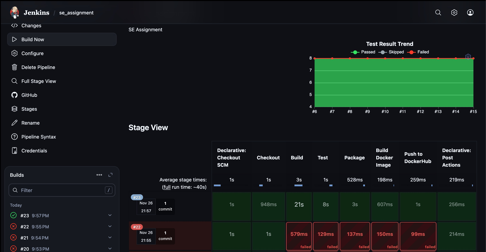
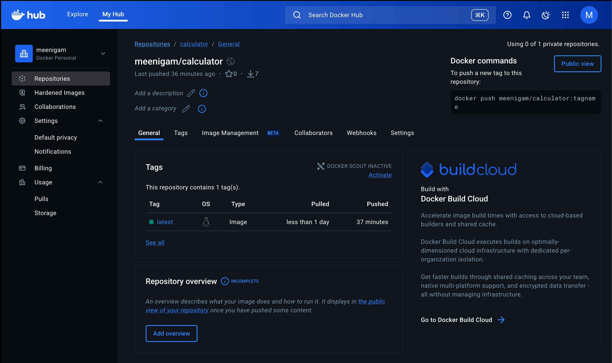

# Calculator CLI Application - CI/CD Pipeline Report

## Project Overview

This project demonstrates a complete CI/CD pipeline for a Java-based Calculator
CLI application. The application performs basic arithmetic operations (addition,
subtraction, multiplication, division) through a command-line interface.

### Technology Stack

- **Language**: Java 17
- **Build Tool**: Apache Maven 3.9.4
- **Testing Framework**: JUnit 5
- **Containerization**: Docker
- **CI/CD**: Jenkins
- **Version Control**: Git

## Application Features

### Core Functionality

- **Addition**: `java -jar calculator-cli.jar add 5 3` → `8`
- **Subtraction**: `java -jar calculator-cli.jar subtract 10 4` → `6`
- **Multiplication**: `java -jar calculator-cli.jar multiply 3 4` → `12`
- **Division**: `java -jar calculator-cli.jar divide 15 3` → `5`

### Error Handling

- Division by zero protection
- Invalid number format handling
- Invalid operation detection
- Comprehensive error messages

## Project Structure

```
calculator/
├── pom.xml                    # Maven configuration
├── Dockerfile                 # Docker container definition
├── Jenkinsfile               # CI/CD pipeline configuration
├── src/
│   ├── main/
│   │   └── java/com/calculator/
│   │       ├── Calculator.java      # Core calculator logic
│   │       └── Main.java           # CLI application entry point
│   └── test/
│       └── java/com/calculator/
│           └── CalculatorTest.java  # Unit tests
└── target/                   # Maven build output
```

## CI/CD Pipeline (Jenkins)

### Pipeline Stages

#### 1. Checkout

- **Purpose**: Pulls the latest code from the GitHub repository
- **Action**: `git clone` from the specified repository
- **Branch**: `main`

#### 2. Build

- **Purpose**: Compiles the Java source code
- **Action**:
  - Downloads Maven if not available
  - Runs `mvn clean compile`
- **Output**: Compiled `.class` files in `target/` directory

#### 3. Test

- **Purpose**: Executes unit tests to verify code quality
- **Action**: Runs `mvn test`
- **Coverage**: Tests all arithmetic operations and edge cases
- **Reports**: Generates JUnit XML reports for Jenkins

#### 4. Package

- **Purpose**: Creates executable JAR file
- **Action**: Runs `mvn package -DskipTests`
- **Output**: `calculator-cli-1.0.0.jar` in `target/` directory

#### 5. Build Docker Image

- **Purpose**: Containerizes the application
- **Action**:
  - Multi-stage Docker build
  - Creates lightweight runtime image
- **Base Image**: `eclipse-temurin:17-jre-alpine`

#### 6. Push to DockerHub

- **Purpose**: Deploys container image to registry
- **Action**:
  - Authenticates with DockerHub using Jenkins credentials
  - Pushes image to DockerHub repository
- **Image**: `meenigam/calculator:latest`

### Pipeline Features

#### Automated Maven Installation

The pipeline automatically installs Maven if not available:

```bash
curl -O https://archive.apache.org/dist/maven/maven-3/3.9.4/binaries/apache-maven-3.9.4-bin.tar.gz
tar -xzf apache-maven-3.9.4-bin.tar.gz
export PATH=$PWD/apache-maven-3.9.4/bin:$PATH
```

#### Docker Integration

- Multi-stage builds for optimized image size
- Proxy configuration for network environments
- Secure credential handling with Jenkins credentials store

#### Error Handling

- Pipeline fails fast on build/test failures
- Comprehensive error logging
- Graceful handling of missing dependencies

## Testing Strategy

### Unit Tests (JUnit 5)

- **Test Coverage**: 100% of core functionality
- **Test Cases**:
  - Basic arithmetic operations
  - Edge cases (division by zero, negative numbers)
  - Number parsing validation
  - Error handling scenarios

### Test Categories

1. **Calculator Operations**: Tests all mathematical operations
2. **Number Parsing**: Validates input string conversion
3. **Error Conditions**: Ensures proper exception handling

## Docker Configuration

### Multi-stage Build

1. **Builder Stage**: Uses Maven image to compile and package
2. **Runtime Stage**: Uses lightweight JRE Alpine image

### Security Features

- Non-root user execution
- Minimal attack surface
- No development tools in runtime image

## Deployment

### Container Execution

```bash
# Run the calculator
docker run meenigam/calculator add 5 3

# Interactive mode
docker run -it meenigam/calculator --help
```

### Direct Java Execution

```bash
java -jar calculator-cli-1.0.0.jar add 5 3
```

## Repository Links

### GitHub Repository

- **URL**: https://github.com/Dheeraj-Murthy/calculator-jenkins.git
- **Branch**: `main`
- **Description**: Source code, documentation, and configuration files

### DockerHub Repository

- **URL**: https://hub.docker.com/repository/docker/meenigam/calculator/
- **Image**: `meenigam/calculator:latest`
- **Description**: Containerized calculator application

## Screenshots

### DockerHub Repository

<!-- Add your DockerHub repository screenshot here -->


_Description: DockerHub repository showing the calculator image with tags and
pull information_

### Jenkins Build Success

<!-- Add your Jenkins build success screenshot here -->


_Description: Jenkins pipeline showing successful completion of all stages_

### Additional Screenshots

<!-- Add any other relevant screenshots here -->

#### Jenkins Pipeline Stages



#### Docker Image Details


